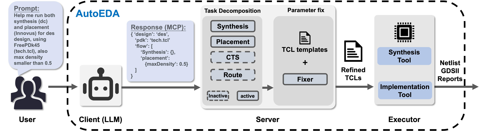
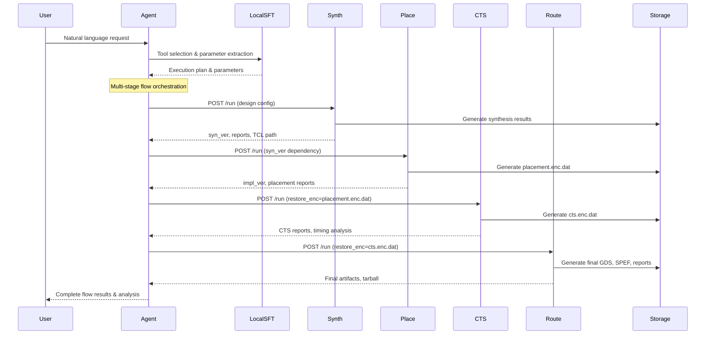

# AutoEDA: Enabling EDA Flow Automation through Microservice-Based LLM Agents

[](https://www.python.org/downloads/)
[](https://fastapi.tiangolo.com/)

A production-grade, microservice-based Electronic Design Automation (EDA) platform that transforms natural language instructions into complete RTL-to-GDSII flows. Built with local fine-tuned AI models, MCP integration, and supports both commercial and open-source EDA tools.

[[Paper](https://arxiv.org/abs/2508.01012)] [[Website](https://llm4chip.org/)][[Video](https://llm4chip.org/demo_v3.mp4)]


> **Note:** This repository is a copy of a private project with all proprietary source code files removed. Only documentation remain for reference.

---


## Key Features

### AI-Powered Workflow Management
- **Natural Language Processing**: Local fine-tuned Qwen model converts design requirements to EDA parameters
- **Intelligent Tool Selection**: Automatic flow stage determination and parameter optimization
- **MCP Integration**: Model Context Protocol for seamless AI-EDA tool communication
- **Strategy Optimization**: Performance, power, area, and speed optimization strategies

### Microservice Architecture
- **Four Independent Services**: Synthesis, Placement, CTS, and Routing with dedicated FastAPI endpoints
- **Fault Isolation**: Service failures don't affect the entire flow
- **Technology Agnostic**: Support for both FreePDK45 and ASAP7 technologies
- **Scalable Design**: Each service scales independently with session management

### Template-Driven TCL Generation
- **Modular Templates**: Technology-specific script templates for different PDKs
- **Dynamic Parameter Injection**: Runtime parameter substitution and environment setup
- **Comprehensive Flow Support**: Complete RTL-to-GDSII flow automation
- **Quality Evaluation**: Built-in CodeBLEU-TCL evaluation framework

---

## System Architecture
<p align="center">
    
</p>


### Service Architecture Details

| Service | Port | Purpose | Key Features |
|---------|------|---------|--------------|
| **Intelligent Agent** | 8000 | AI orchestration & workflow management | Local SFT model, session management, MCP protocol |
| **Synthesis Service** | 18001 | RTL-to-gate synthesis | Template-driven TCL, Design Compiler integration |
| **Placement Service** | 18002 | Floorplan + Powerplan + Placement | Multi-stage unified flow, workspace management |
| **CTS Service** | 18003 | Clock tree synthesis | Post-placement optimization, timing-driven CTS |
| **Routing Service** | 18004 | Global/detail routing + final save | Complete backend flow, artifact generation |

### Data Flow Architecture



<!-- ---

### Template System
```
src/scripts/
├── FreePDK45/                    # FreePDK45 technology
│   ├── tech.tcl                  # Technology configuration
│   ├── frontend/                 # Synthesis templates
│   │   ├── combined_synthesis.tcl # Complete synthesis flow
│   │   └── yosys/               # Open-source Yosys support
│   │       └── synth.tcl        # Yosys synthesis script
│   └── backend/                  # Physical design templates
│       ├── combined_placement.tcl # Floorplan + power planning + placement
│       ├── combined_cts.tcl      # Clock tree synthesis
│       └── combined_routing.tcl  # Global/detailed routing + final save
└── ASAP7/                       # ASAP7 technology support
    ├── tech.tcl                 # ASAP7 technology configuration
    ├── frontend/
    │   └── combined_synthesis.tcl
    └── backend/
        ├── combined_placement.tcl
        ├── combined_cts.tcl
        └── combined_routing.tcl
``` -->

### Local AI Model Integration
- **Fine-tuned Qwen Model**: Specialized EDA domain model trained on TCL scripts
- **No API Dependencies**: Complete offline operation without external API keys
- **Domain-Specific Training**: Model trained on EDA-specific commands and workflows
- **MCP Protocol**: Standardized AI-tool communication interface

---

## Prerequisites

### System Requirements
| Component | Requirement | Notes |
|-----------|-------------|-------|
| **Operating System** | Linux x86-64 | Tested on RHEL 8.10 |
| **Python** | 3.9+ | See requirements.txt for dependencies |
| **Memory** | 16GB+ | Recommended for large designs |
| **Storage** | 30GB+ | For design databases and results |

### EDA Tools
| Tool | Version | Purpose |
|------|---------|---------|
| **Synopsys Design Compiler** | 2023.12+ | RTL synthesis |
| **Cadence Innovus** | 21.17+ | Physical implementation |
| **Valid Licenses** | Required | Both tools need proper licensing |

---

## Installation

### 1. Clone Repository
```bash
git clone https://github.com/Duke-CEI-Center/AutoEDA.git
cd AutoEDA
```

### 2. Python Environment Setup
```bash
# Create virtual environment
python3 -m venv venv
source venv/bin/activate

# Install dependencies
pip install -r requirements.txt
```

### 3. Configuration

#### **Environment Variables Setup**

Modify the `example.env` file in the `src/` directory for EDA tool configuration:

```bash
# Synopsys Design Compiler path
EDA_SYNOPSYS_PATH=/path/to/synopsys/bin

# Cadence Innovus path
EDA_CADENCE_PATH=/path/to/cadence/bin
```

Rename the file to `.env` and it will be used automatically.

#### **Persistent PATH Configuration**
```bash
# Add EDA tools to PATH
echo 'export PATH="/opt/synopsys/bin:/opt/cadence/bin:$PATH"' >> ~/.bashrc
source ~/.bashrc
```

### 4. EDA Tool Setup
Ensure EDA tools are properly installed and licensed:
```bash
# Verify Design Compiler
dc_shell -version

# Verify Innovus
innovus -version
```

---

## Quick Start

### 1. Environment Setup
```bash
# Activate virtual environment
source venv/bin/activate
```

### 2. Run Interactive Demo

```bash
# Run the interactive demo
python src/demo.py
```
In the terminal, enter your design query as prompted.

### 3. Alternative: Run Manually

#### 3.1 Start EDA Microservices
```bash
# Launch all 4 EDA microservices
python3 src/run_server.py --server all
```
<!-- # Or start individual servers
python3 src/run_server.py --server synthesis    # Port 18001
python3 src/run_server.py --server placement    # Port 18002
python3 src/run_server.py --server cts          # Port 18003
python3 src/run_server.py --server routing      # Port 18004

# Verify services are running
curl http://localhost:18001/docs  # Synthesis API docs
curl http://localhost:18002/docs  # Placement API docs
curl http://localhost:18003/docs  # CTS API docs
curl http://localhost:18003/docs  # Routing API docs
``` -->

#### 3.2 Start AI Agent
```bash
# Launch intelligent agent
python3 src/mcp_agent_client.py
```

#### 3.3 Run Your First Design
```bash
# Complete RTL-to-GDSII flow with natural language
curl -X POST http://localhost:8000/agent \
  -H "Content-Type: application/json" \
  -d '{
    "user_query": "Run complete flow for design des with high performance optimization",
    "session_id": "demo_session"
  }'
```
For comprehensive documentation, usage examples, and advanced features, see [QUICK START GUITDE](QUICK_START_GUIDE.md) and [API DOCUMENTATION](API_DOCUMENTATION.md) .
<!-- ### 5. Alternative: Direct Service API
```bash
# Step 1: Synthesis
curl -X POST http://localhost:18001/run \
  -H "Content-Type: application/json" \
  -d '{
    "design": "aes",
    "tech": "FreePDK45",
    "clk_period": 5.0,
    "force": true
  }'

# Step 2: Placement (using synthesis results)
curl -X POST http://localhost:18002/run \
  -H "Content-Type: application/json" \
  -d '{
    "design": "aes",
    "tech": "FreePDK45",
    "syn_ver": "cpV1_clkP1_drcV1_20241201_143022",
    "target_util": 0.8,
    "force": true
  }'
``` -->

---

<!-- ## API Documentation

### Intelligent Agent API

#### POST `/agent`
Execute natural language EDA requests.

**Request:**
```json
{
  "user_query": "Run synthesis for design aes with 500MHz clock",
  "session_id": "optional_session_id"
}
```

**Response:**
```json
{
  "tool_called": "synth",
  "tool_input": {
    "design": "aes",
    "clk_period": 2.0,
    "tech": "FreePDK45"
  },
  "tool_output": {
    "status": "ok",
    "log_path": "/path/to/logs",
    "reports": {...}
  },
  "ai_reasoning": "Selected synthesis with 2ns period for 500MHz target",
  "suggestions": ["Consider power optimization after synthesis"]
}
```

#### GET `/session/{session_id}/history`
Retrieve session history and preferences.

### Service APIs

Each service provides OpenAPI documentation at `http://localhost:<port>/docs`:

- **Synthesis**: http://localhost:18001/docs
- **Placement**: http://localhost:18002/docs  
- **CTS**: http://localhost:18003/docs
- **Route & Save**: http://localhost:18003/docs 

----->

## Project Structure

```
AutoEDA/
├── src/                            # Source code directory
│   ├── server/                     # EDA microservices
│   │   ├── base_server.py          # Base server class
│   │   ├── synthesis_server.py     # Synthesis service (port 18001)
│   │   ├── placement_server.py     # Placement service (port 18002)
│   │   ├── cts_server.py           # CTS service (port 18003)
│   │   ├── routing_server.py       # Routing service (port 18004)
│   │   └── executor.py             # EDA tool executor
│   ├── mcp_agent_client.py         # AI orchestration agent (port 8000)
│   ├── demo.py                     # Interactive demo script
│   ├── run_server.py               # Multi-server launcher script
│   ├── example.env                 # Environment configuration template
│   ├── sft_model/                  # Fine-tuned Qwen model
│   ├── scripts/                    # TCL templates
│   │   ├── FreePDK45/              # FreePDK45 TCL templates
│   │   └── ASAP7/                  # ASAP7 TCL templates
│   ├── codebleu_tcl/               # TCL code quality evaluation
│   └── benchmark_generation/       # Benchmark generation tools
├── designs/                        # Benchmark designs
│   ├── des/                        # DES crypto design
│   ├── b14/                        # B14 benchmark design
│   ├── spi/                        # SPI communication protocol
│   └── s27, s208_1, s1196...       # ITC99 benchmark suite
├── libraries/                      # PDK and standard cell libraries
│   ├── FreePDK45/                  # FreePDK45 libraries
│   └── ASAP7/                      # ASAP7 libraries
├── data/                           # Example training and evaluation data
├── tests/                          # Test suite
├── requirements.txt                # Python dependencies
├── README.md                       # This file
├── QUICK_START_GUIDE.md            # Quick start instructions
├── API_DOCUMENTATION.md            # Detailed API reference
├── MCP_IMPLEMENTATION.md           # MCP implementation details
```

---

## TCL Code Quality Evaluation

The platform includes a specialized **CodeBLEU-TCL** evaluation framework for assessing generated TCL script quality in EDA workflows. This framework provides domain-specific evaluation metrics tailored for electronic design automation.

### Key Features
- **EDA-Aware Evaluation**: Specialized weights for synthesis, placement, CTS, and routing stages
- **Domain-Specific Commands**: Recognition of 271+ EDA tool commands across the design flow
- **Multi-Dimensional Metrics**: Combines n-gram matching, syntax analysis, and dataflow analysis

### Quick Usage
```bash
cd src/codebleu_tcl
python3 demo/run_demo.py  # Run interactive evaluation demo
```

---

## Benchmark Generation Pipeline

The platform includes a comprehensive **Benchmark Generation Pipeline** for creating structured EDA tool call datasets with validated natural language prompts and ground truth responses. This framework enables systematic evaluation and training of LLM models for EDA workflow automation.

### Key Features
- **Structured Ground Truth**: Generate EDA tool call sequences with various parameter combinations
- **Natural Language Conversion**: Transform tool calls into human-readable prompts using LLM
- **Prompt Validation**: Ensure consistency between prompts and expected tool responses

### Quick Usage
```bash
cd src/benchmark_generation
python demo_benchmark_generation.py --api_key your_openai_api_key  # Full pipeline
python demo_benchmark_generation.py  # Skip prompt generation (no API key needed)
```

For comprehensive documentation, usage examples, and advanced features, see [Benchmark Generation README](src/benchmark_generation/README.md).

<!-- ## Advanced Configuration

### Custom EDA Tool Integration
```python
# In src/server/custom_tool_server.py
class CustomToolReq(BaseModel):
    design: str
    custom_param: float = 1.0

def generate_custom_tcl(req: CustomToolReq) -> str:
    # Your custom TCL generation logic
    return tcl_content

# Register in TOOLS dictionary
TOOLS["custom_tool"] = {"port": 18004, "path": "/run"}
```

### Template Customization
```tcl
# src/scripts/FreePDK45/backend/combined_placement.tcl
set custom_param $env(custom_param)

# Your custom EDA commands
customCommand -param $custom_param
```

### Strategy Development
```python
# In src/mcp_agent_client.py
STRATEGY_PARAMS["custom_strategy"] = {
    "design_flow_effort": "custom",
    "target_util": 0.75,
    "custom_param": 2.0
}
``` -->

<!-- 
---

## Testing

### Unit Tests
```bash
# Run all tests
pytest tests/

# Run specific service tests
pytest tests/test_synth_server.py -v

# Run with coverage
pytest --cov=src/server tests/
```

### Integration Tests
```bash
# Test complete flow
python3 tests/integration/test_full_flow.py

# Test AI agent
python3 tests/integration/test_agent.py
```

### Load Testing
  ```bash
# Install load testing tools
pip install locust

# Run load tests
locust -f tests/load/test_agent_load.py --host=http://localhost:8000
```

---

## Monitoring and Observability

### Logging Configuration
```python
# Configure structured logging
import logging
import json

class JSONFormatter(logging.Formatter):
    def format(self, record):
        return json.dumps({
            'timestamp': self.formatTime(record),
            'level': record.levelname,
            'service': 'synth_server',
            'message': record.getMessage()
        })
```

### Health Checks
```bash
# Check service health
curl http://localhost:18001/health
curl http://localhost:8000/health

# Check all services
./scripts/health_check.sh
```

### Metrics Collection
```python
# Add Prometheus metrics
from prometheus_client import Counter, Histogram

request_count = Counter('requests_total', 'Total requests')
request_duration = Histogram('request_duration_seconds', 'Request duration')
```
-->

---

## License

This project is licensed under the creative commons - see the [LICENSE](./LICENSE.md) file for details.


## Acknowledgments

- **Qwen Team** for the foundation model enabling local fine-tuning
- **Synopsys** and **Cadence** for EDA tool integration
- **FreePDK45** and **ASAP7** communities for open-source PDKs
- **OpenLane** project for open-source EDA reference designs
- **FastAPI** and **Pydantic** for excellent web framework
- **Open-source EDA community** for inspiration and collaboration


## Support

- **Email**: yl996@duke.edu
- **Discussion**: [Join our discussion](https://github.com/Duke-CEI-Center/AutoEDA/discussions)
- **Documentation**: [Quick Start Guide](./QUICK_START_GUIDE.md)
- **Issues**: [GitHub Issues](https://github.com/Duke-CEI-Center/AutoEDA/issues)

---

**Made with passion for the EDA and open-source community from Duke University**
